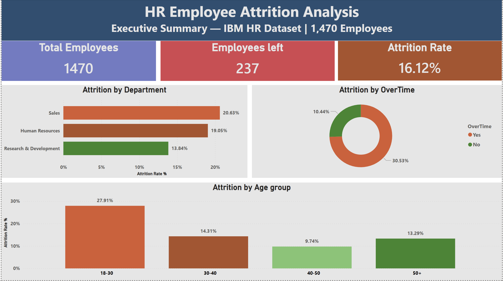
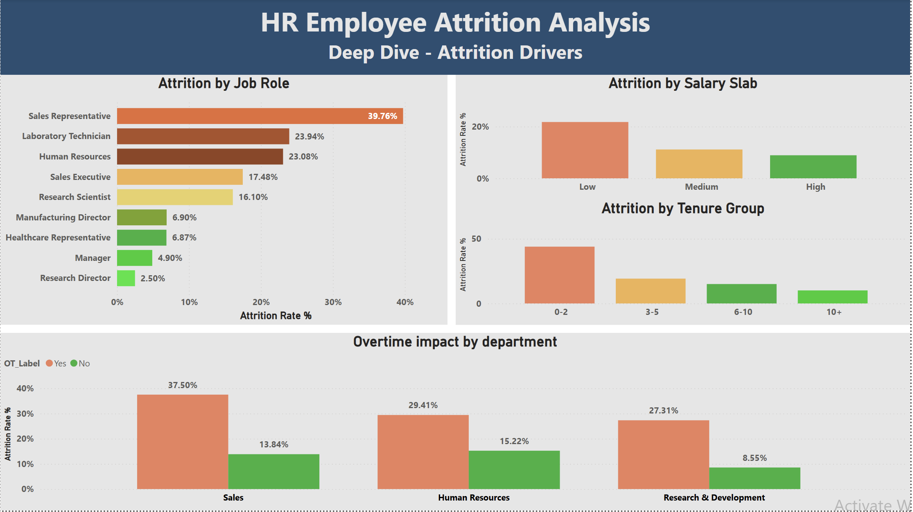
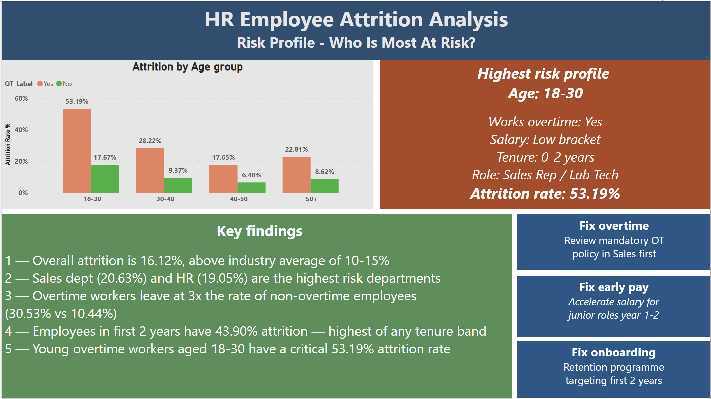

# IBM HR Employee Attrition Analysis

> **Identifying why employees leave — and what HR can do about it.**
> A full end-to-end data analysis project using Excel, MySQL and Power BI.

---

## Dashboard Preview

### Page 1 — Executive Summary


### Page 2 — Deep Dive: Attrition Drivers


### Page 3 — Risk Profile


---

## Project Overview

The HR Director of a mid-size organisation raised a critical concern: the company is losing too many good people, and no one has diagnosed why. This project was commissioned to identify the root causes of attrition and deliver targeted, data-backed recommendations.

**Dataset:** IBM HR Analytics Employee Attrition & Performance dataset — 1,470 employees, 35 variables.

**Tools used:**
- **Excel** — Data cleaning, validation and feature engineering
- **MySQL** — Exploratory data analysis via 10 structured queries
- **Power BI** — 3-page interactive dashboard

---

## Key Findings

| Finding | Detail |
|---|---|
| Overall attrition rate | **16.12%** — above industry average of 10–15% |
| Highest risk department | **Sales at 20.63%** |
| Overtime impact | Overtime workers leave at **30.53%** vs 10.44% without — 3× higher |
| Highest risk age group | **18–30 at 27.91%** — nearly double the company average |
| Most critical tenure band | **0–2 years at 43.90%** — almost 1 in 2 leave |
| Highest risk job role | **Sales Representative at 39.76%** |
| The smoking gun | Employees aged **18–30 working overtime leave at 53.19%** |

---

## The High Risk Profile

The analysis unambiguously identifies one employee profile driving the majority of attrition:

```
Age:      18–30
Overtime: Yes
Salary:   Low bracket (<5k monthly)
Tenure:   0–2 years
Role:     Sales Representative or Laboratory Technician
Rate:     53.19% attrition — more than 3× the company average
```

---

## Project Structure

```
IBM-HR-Attrition-Analysis/
│
├── screenshots/
│   ├── 01_Executive_summary.png
│   ├── 02_Attrition_drivers.png
│   └── 03_Risk_profile.png
│
├── data/
│   └── HR_Attrition_Clean.xlsx        ← Cleaned dataset with engineered features
│
├── sql/
│   └── hr_attrition_EDA.sql           ← All 10 EDA queries
│
├── powerbi/
│   └── HR_employee_attrition.pbix     ← Full 3-page Power BI dashboard
│
├── presentation/
│   └── HR_Attrition_Analysis.pptx    ← 12-slide project presentation
│
└── README.md
```

---

## Methodology

### 1. Business Context
Translated the HR Director's brief into five analytical questions: what is the attrition rate, where is it happening, who is leaving, why, and what can HR do.

### 2. Data Audit
- 1,470 rows × 35 columns, zero missing values, zero duplicates
- Dropped 3 constant columns: `EmployeeCount`, `Over18`, `StandardHours`
- Flagged `PerformanceRating` — only values 3 and 4 present out of a 1–4 scale
- Identified 16%:84% class imbalance in the target variable

### 3. Data Cleaning & Feature Engineering
Five new features created in Excel before import:

| Feature | Logic | Purpose |
|---|---|---|
| `Attrition_Flag` | Yes/No → 1/0 | Enables rate calculations |
| `Age_Group` | `<30→'18-30'`, `<40→'30-40'`, `<50→'40-50'`, else `'50+'` | Demographic segmentation |
| `Tenure_Group` | `<3→'0-2'`, `<6→'3-5'`, `<11→'6-10'`, else `'10+'` | Tenure risk banding |
| `Salary_Slab` | `<5k→'Low'`, `<10k→'Medium'`, else `'High'` | Compensation banding |
| `OT_Label` | OverTime flag → Yes/No | Clean dashboard labels |

### 4. Exploratory Data Analysis — MySQL
10 queries across two tiers:

**Single variable:**
```sql
-- Attrition rate pattern used across all queries
SELECT
    Department,
    COUNT(*) AS total_employees,
    SUM(Attrition_Flag) AS employees_left,
    ROUND(100.0 * SUM(Attrition_Flag) / COUNT(*), 2) AS attrition_rate_pct
FROM hr_attrition_clean
GROUP BY Department
ORDER BY attrition_rate_pct DESC;
```

**Cross-tabulation (Q9 — the smoking gun):**
```sql
SELECT
    Age_Group,
    OverTime,
    COUNT(*) AS total_employees,
    SUM(Attrition_Flag) AS employees_left,
    ROUND(100.0 * SUM(Attrition_Flag) / COUNT(*), 2) AS attrition_rate_pct
FROM hr_attrition_clean
GROUP BY Age_Group, OverTime
ORDER BY attrition_rate_pct DESC;
```

### 5. Power BI Dashboard
Three-page dashboard with consistent red/orange = high risk, green = stable color logic:
- **Page 1 — Executive Summary:** KPI cards, attrition by department, age group, overtime donut
- **Page 2 — Deep Dive:** Job role breakdown, salary slab, tenure group, overtime × department grouped bar
- **Page 3 — Risk Profile:** Age × overtime cross chart, highest risk profile card, key findings, recommendations

---

## Recommendations

### 01 — Fix Overtime Policy `HIGH PRIORITY`
Overtime workers leave at 3× the rate of non-overtime employees. Sales with overtime sits at 37.50%. R&D without overtime is a healthy 8.55% — proving the department is not the problem, the workload policy is.
- Audit which roles are driving mandatory overtime
- Introduce overtime caps or enhanced compensation for affected roles
- Start with Sales department — highest combined risk

### 02 — Accelerate Junior Salaries `HIGH PRIORITY`
No high-salary employees exist in the 0–2 year tenure band — early career staff are uniformly underpaid. The attrition staircase (43.90% → 10.05%) maps perfectly to salary progression.
- Introduce performance-linked salary acceleration for top junior performers
- Focus on Sales Representatives (39.76%) and Laboratory Technicians (23.94%) first
- Don't wait for tenure-based increments — high performers leave before they arrive

### 03 — Early Retention Programme `MEDIUM PRIORITY`
The first 2 years are the highest-risk window — 43.90% of employees in this band leave.
- Design a structured 24-month onboarding and mentorship programme
- Pair junior hires with senior mentors from the stable 40–50 cohort (6.48% attrition)
- Include quarterly career progression conversations and clear promotion pathway visibility

---

## EDA Results Summary

<details>
<summary>Click to expand full query results</summary>

**Overall attrition rate**
| Total employees | Employees left | Attrition rate |
|---|---|---|
| 1,470 | 237 | 16.12% |

**By Department**
| Department | Rate |
|---|---|
| Sales | 20.63% |
| Human Resources | 19.05% |
| Research & Development | 13.84% |

**By Age Group**
| Age Group | Rate |
|---|---|
| 18–30 | 27.91% |
| 30–40 | 14.31% |
| 50+ | 13.29% |
| 40–50 | 9.74% |

**By OverTime**
| OverTime | Rate |
|---|---|
| Yes | 30.53% |
| No | 10.44% |

**By Salary Slab**
| Slab | Rate |
|---|---|
| Low | 21.76% |
| Medium | 11.14% |
| High | 8.90% |

**By Tenure Group**
| Tenure | Rate |
|---|---|
| 0–2 years | 43.90% |
| 3–5 years | 19.17% |
| 6–10 years | 14.99% |
| 10+ years | 10.05% |

**By Job Role**
| Role | Rate |
|---|---|
| Sales Representative | 39.76% |
| Laboratory Technician | 23.94% |
| Human Resources | 23.08% |
| Sales Executive | 17.48% |
| Research Scientist | 16.10% |
| Manufacturing Director | 6.90% |
| Healthcare Representative | 6.87% |
| Manager | 4.90% |
| Research Director | 2.50% |

**Age Group × OverTime (Cross Analysis)**
| Age Group | With OT | No OT |
|---|---|---|
| 18–30 | **53.19%** | 17.67% |
| 30–40 | 28.22% | 9.37% |
| 50+ | 22.81% | 8.62% |
| 40–50 | 17.65% | 6.48% |

</details>

---

## Author

**Abhinandh**
Entry-level Data Analyst | Excel · MySQL · Power BI

---

## Dataset Source

IBM HR Analytics Employee Attrition & Performance
Available on [Kaggle](https://www.kaggle.com/datasets/pavansubhasht/ibm-hr-analytics-attrition-dataset)
